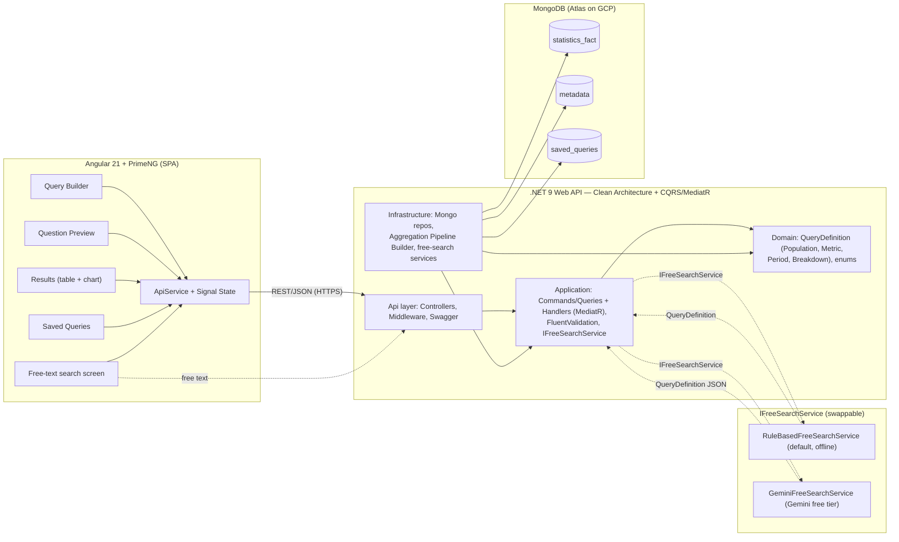

# Deep Search — Architecture

System overview for the CBS (הלמ"ס) **Deep Search** PoC: dynamic, SQL-free
querying of a central government statistics dataset, plus a free-text / LLM mode.

- **Client:** Angular 21 + PrimeNG (SPA)
- **Backend:** .NET 9 Web API — Clean Architecture + CQRS/MediatR
- **Database:** MongoDB (local Docker → MongoDB Atlas on GCP)
- **Free-text / LLM:** `IFreeSearchService` abstraction — `RuleBasedFreeSearchService` (default, offline) + `GeminiFreeSearchService` (Gemini free tier)

---

## Architecture diagram (Mermaid)



---

## Key flows

**Manual query:** Query Builder → API `ExecuteQuery` → Aggregation Pipeline Builder
→ MongoDB → results (table + chart) back to client.

**Natural-language query:** Free-text screen → `FreeSearch` handler →
`IFreeSearchService` (RuleBased or Gemini) → `QueryDefinition` → shown to user for
confirmation → **same** `ExecuteQuery` path → MongoDB. The LLM never touches the
data or computes numbers; it only produces the structured `QueryDefinition`.

**Saved query:** `SaveQuery` / `RunSavedQuery` → `saved_queries` collection.

---

## Dependency rule (Clean Architecture)

`Api → Application → Domain` and `Infrastructure → Application/Domain`.
Domain depends on nothing. Application defines interfaces (e.g. `IFreeSearchService`,
repositories); Infrastructure implements them.

---

## Deployment / hosting (free tier)

| Piece | Host |
|-------|------|
| Source code | GitHub (public repo) |
| Database | MongoDB Atlas M0 (free) |
| Backend (.NET 9) | Google Cloud Run (scales to zero) |
| Frontend (Angular) | Firebase Hosting |
| CI/CD | GitHub Actions → Cloud Run + Firebase Hosting |

> Note: free backend tiers scale to zero, so the first request after idle may take
> 10–40s (cold start). Secrets (Mongo connection string, Gemini key) are provided
> as environment variables / GCP Secret Manager, never committed.

---

## Prompt for AI diagram tools

Paste into Eraser DiagramGPT, napkin.ai, Excalidraw AI, or ask ChatGPT/Claude to
output Mermaid:

```
Create a software architecture diagram for a Proof-of-Concept system called
"Deep Search" — a dynamic, SQL-free querying system for government statistics
(employment, education, population, geography).

Show four layered groups, left to right, with arrows for data flow:

1) CLIENT (Angular 21 + PrimeNG single-page app), containing these components:
   - Query Builder screen (population / metric / time period / breakdown selectors)
   - Question Preview (readable Hebrew sentence of the built query)
   - Results screen (PrimeNG table + chart)
   - Saved Queries screen
   - Free-text search screen (LLM)
   - An ApiService (typed HTTP client) and a signal-based State service
   The client talks to the backend over REST/JSON (HTTPS).

2) BACKEND — a .NET 9 Web API using Clean Architecture + CQRS with MediatR.
   Show it as four nested layers with the dependency rule
   (Api -> Application -> Domain ; Infrastructure -> Application/Domain):
   - Api layer: thin Controllers, DI wiring, global error-handling middleware, Swagger
   - Application layer: CQRS Commands/Queries + Handlers via MediatR
     (GetMetadata, ExecuteQuery, SaveQuery, GetSavedQueries, RunSavedQuery,
      FreeSearch), FluentValidation pipeline, and the IFreeSearchService interface
   - Domain layer: QueryDefinition (Population, Metric, Period, Breakdown), enums.
     No dependencies.
   - Infrastructure layer: MongoDB driver + repositories, an Aggregation-Pipeline
     Builder, and the free-search service implementations

3) DATA — MongoDB (local Docker -> MongoDB Atlas on GCP) with three collections:
   statistics_fact, metadata, saved_queries.

4) LLM / AI — an IFreeSearchService abstraction with two interchangeable
   implementations behind it: RuleBasedFreeSearchService (default, offline) and
   GeminiFreeSearchService (Gemini API free tier). Show that the free-text screen ->
   FreeSearch handler -> IFreeSearchService -> returns a QueryDefinition, which then
   reuses the SAME ExecuteQuery path as the manual builder.

Key flows to draw as labeled arrows:
- Manual: Query Builder -> API ExecuteQuery -> Aggregation Pipeline Builder ->
  MongoDB -> results (table + chart) back to client.
- NL: Free-text screen -> FreeSearch -> IFreeSearchService (RuleBased or Gemini) ->
  QueryDefinition -> shown to user -> same ExecuteQuery path -> MongoDB.
- Saved: SaveQuery / RunSavedQuery -> saved_queries collection.

Also show deployment/hosting as a small note layer: Angular hosted on Firebase
Hosting, .NET API on Google Cloud Run, MongoDB Atlas, source on GitHub with
CI/CD via GitHub Actions.

Style: clean boxes grouped by layer, directional arrows with labels, GCP-themed.
```

For a **C4-style** view, append: *"Use the C4 model: produce a Container diagram
showing Person (Government user) → Angular SPA → .NET API → MongoDB, with the
Gemini API as an external system."*
