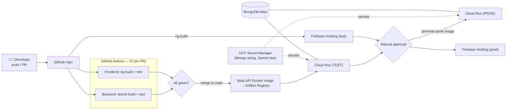

# Deep Search — DevOps

> Scope note: the home-task asks to **describe briefly** the environments, a
> proposed CI/CD process, configuration management and secrets management — and
> explicitly states there is **no obligation to implement CI/CD**. This document is
> therefore a written proposal (no pipeline files).

---

## Environments (DEV / TEST / PROD)

| Environment | Purpose | Frontend | Backend | Database |
|-------------|---------|----------|---------|----------|
| **DEV** | Local development | `ng serve` (localhost:4200) | `dotnet run` (localhost:5080) | MongoDB via local Docker / portable `mongod` |
| **TEST** | QA / integration / demo | Firebase Hosting preview channel | Cloud Run (test service) | MongoDB Atlas (test DB) |
| **PROD** | Live | Firebase Hosting (prod) | Cloud Run (prod service) | MongoDB Atlas (prod cluster) |

Each environment is fully isolated (separate Cloud Run services, separate Atlas
databases, separate config/secret values). The same container image is promoted
DEV → TEST → PROD; only configuration changes between them.

---

## Proposed CI/CD process

Source lives on **GitHub**; **GitHub Actions** is the proposed CI/CD engine.

**On every Pull Request (CI):**
1. **Backend:** `dotnet restore` → `dotnet build` → `dotnet test` (the 26 unit tests).
2. **Frontend:** `npm ci` → `ng build` → `ng test` (lint + unit).
3. PR is blocked from merging unless both jobs are green.

**On merge to `main` (CD → TEST):**
4. Build a Docker image of the .NET 9 API, push to **Google Artifact Registry**.
5. Deploy that image to the **Cloud Run TEST** service.
6. Build the Angular app and deploy to a **Firebase Hosting** preview/test channel.

**Promotion to PROD (manual approval gate):**
7. A protected "production" environment requires a manual approval.
8. The **same image tag** validated in TEST is deployed to **Cloud Run PROD**;
   the client is released to the Firebase Hosting live channel.

Authentication from GitHub Actions to GCP uses **Workload Identity Federation**
(no long-lived service-account keys stored in GitHub).

---

## Branching strategy — Trunk-Based (chosen)

**Decision: Trunk-Based Development**, not Git Flow.

- `main` is always releasable. Work happens on **short-lived feature branches**
  (hours–2 days) that open a PR, pass CI, and merge back quickly behind small,
  frequent commits.
- Every merge to `main` auto-deploys to **TEST**; PROD is a manual-approval
  promotion of the same image. This pairs naturally with continuous delivery to
  Cloud Run.
- Optional **release tags** (e.g. `v1.0.0`) mark what was promoted to PROD, giving
  traceability without long-lived branches.

**Why not Git Flow here?** Git Flow's long-lived `develop` / `release` / `hotfix`
branches and scheduled release cycles add merge overhead and latency that suit
**versioned, infrequently-released products** (e.g. installed software, multiple
supported versions). This project is a single-deployable web app delivered
continuously to Cloud Run, so trunk-based gives faster feedback, simpler CI/CD,
fewer long-running merges, and a smaller blast radius per change — the better fit
for a PoC and for a small team practising continuous delivery.

---

## Configuration management

- **Backend:** `appsettings.json` holds non-secret defaults; `appsettings.{Environment}.json`
  and **environment variables** override per environment (selected by
  `ASPNETCORE_ENVIRONMENT`). On Cloud Run, values such as the Mongo database name,
  allowed CORS origins and the `FreeSearch:Provider` are set as environment variables.
- **Frontend:** Angular `environment.ts` / `environment.prod.ts` provide the API base
  URL per build configuration (`ng build --configuration production`).
- **Principle:** code is environment-agnostic; only configuration differs between
  DEV / TEST / PROD.

---

## Secrets management

- **No secrets in the repository.** `appsettings.json` contains placeholders only
  (e.g. empty `FreeSearch:Gemini:ApiKey`, localhost Mongo string).
- **Cloud (TEST/PROD):** the Mongo Atlas connection string and the Gemini API key
  are stored in **GCP Secret Manager** and injected into Cloud Run as environment
  variables / mounted secrets at deploy time.
- **CI/CD:** GitHub Actions reads deploy credentials via Workload Identity Federation;
  any pipeline secrets use GitHub **encrypted environment secrets**.
- **Local dev:** developers use **.NET user-secrets** (or a git-ignored `.env`),
  never committed.

---

## Prompt for AI diagram tools (CI/CD pipeline)

Paste into Eraser DiagramGPT, napkin.ai, Excalidraw AI, or ask ChatGPT/Claude to
output Mermaid:

```
Create a CI/CD pipeline diagram for a full-stack app called "Deep Search"
(.NET 9 Web API backend + Angular frontend + MongoDB Atlas database), deployed to
Google Cloud.

Show the flow left-to-right as a pipeline with these stages and labeled arrows:

1) Developer pushes code / opens Pull Request to GitHub.
2) GitHub Actions CI runs two parallel jobs:
   - Backend job: dotnet restore -> dotnet build -> dotnet test (unit tests)
   - Frontend job: npm ci -> ng build -> ng test (lint + unit)
   A red "merge blocked unless green" gate guards the merge.
3) On merge to main (CD to TEST):
   - Build a Docker image of the .NET API -> push to Google Artifact Registry
   - Deploy image to Cloud Run (TEST service)
   - Build Angular app -> deploy to Firebase Hosting (test channel)
4) Manual approval gate ("production approval").
5) Promote the SAME image to Cloud Run (PROD); release Angular to Firebase Hosting (prod).

Also show side elements:
- MongoDB Atlas (TEST db and PROD cluster) connected to the Cloud Run services.
- GCP Secret Manager feeding secrets (Mongo connection string, Gemini API key)
  into Cloud Run.
- GitHub Actions authenticating to GCP via Workload Identity Federation (no keys).

Style: clean left-to-right pipeline, distinct swimlanes for CI vs CD vs PROD,
approval gate highlighted, GCP-themed colors.
```

### Ready-made Mermaid (optional)


